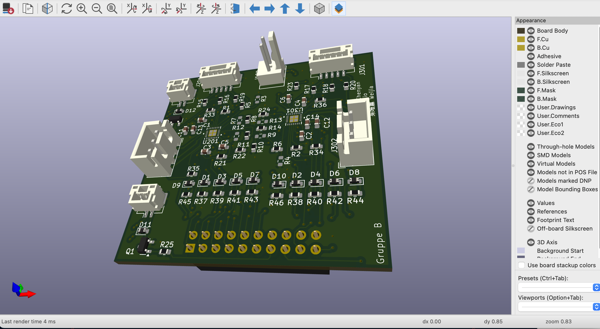
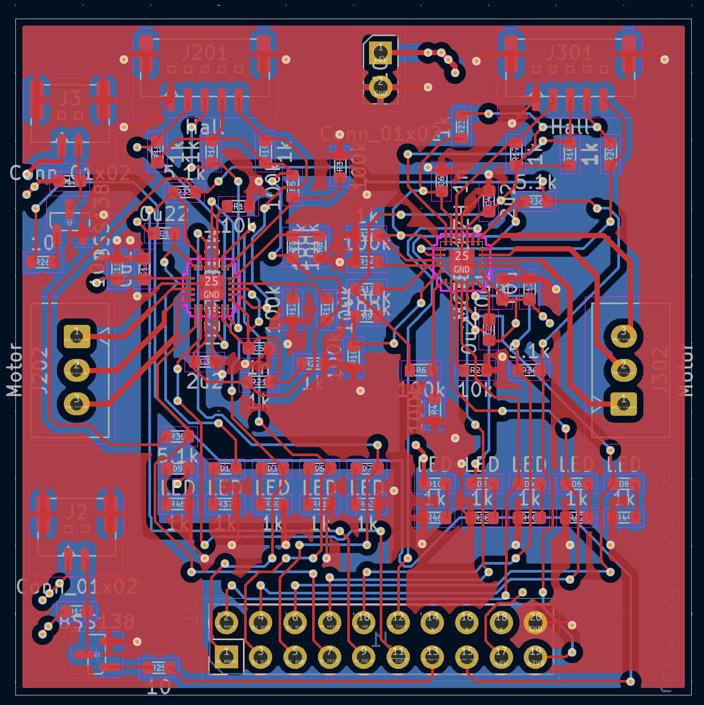
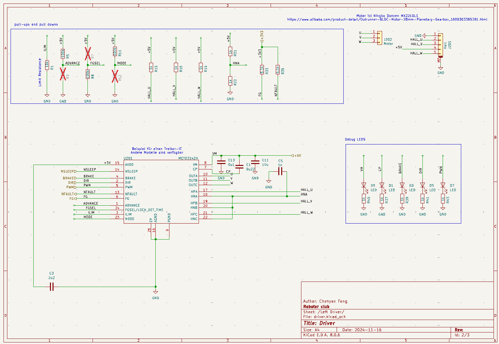

# Autonomer Roboter mit STM32
Dieses Projekt entstand im Rahmen meines Studiums an der RWTH Aachen. Ziel war es, einen Roboter zu bauen, der autonom einfache Bewegungen ausführt.

## Funktionen
- Eigenes Design der Steuerplatine mit KiCad
- Manuelle Bestückung & SMD-Löten
- Firmware in C für STM32
- Nutzung von Modm zum Flashen
- Projektplanung mit Gantt

## Verwendete Technologien
- STM32CubeIDE
- KiCad
- modm
- Logic Analyzer, CoolTerm

## Herausforderungen
- Fehlersuche bei Signalverlusten
- Austausch defekter Komponenten
- Zeitmanagement & Teamkoordination

## Medien

| 3D-Ansicht | Schaltplan |
|-----------|------------|
|  |  |
| 3D-Rendering der Platine | Linker Teil des Schaltplans |